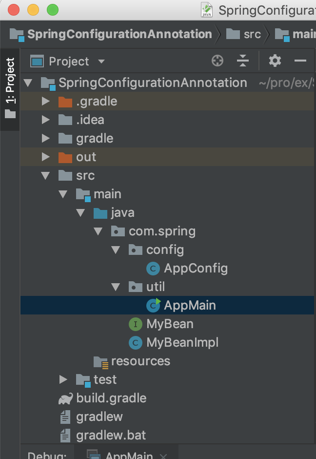
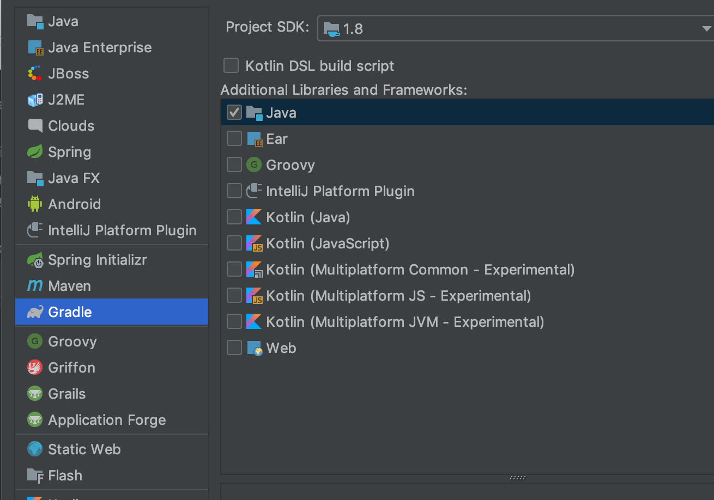
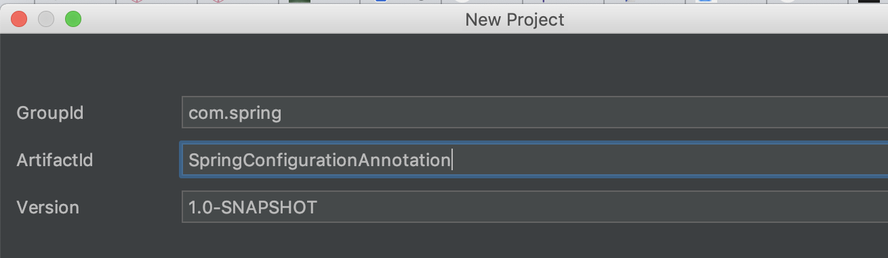
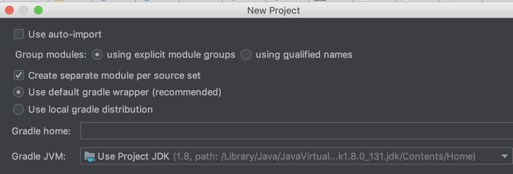
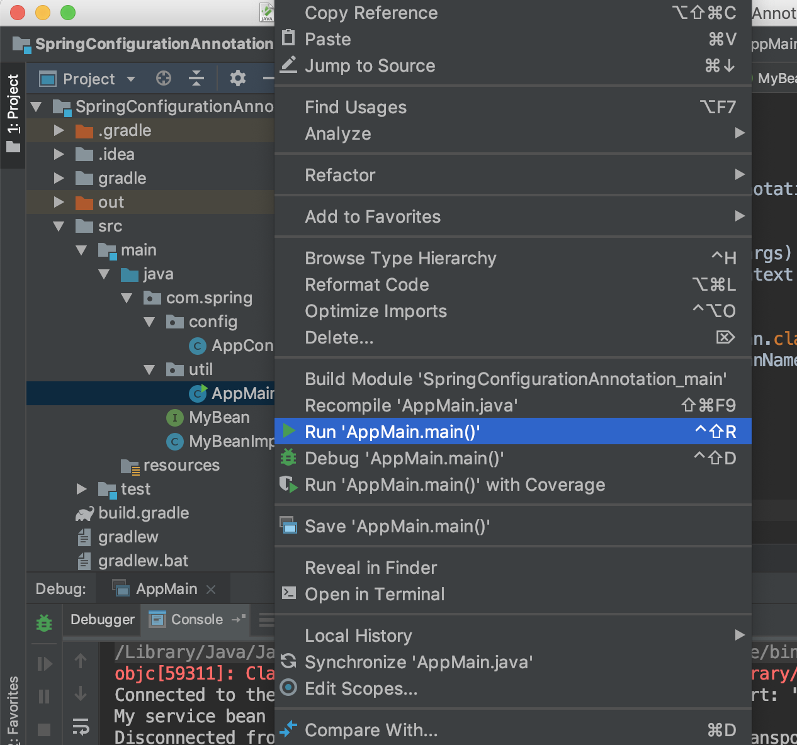

https://examples.javacodegeeks.com/enterprise-java/spring/spring-configuration-annotation-example/ 의 글을 번역해서 올림니다.


스프링 3.x 프레임워크는 XML 파일에서의 bean정의를 자바클래스로 선언할 수 있다. 이 예제는 스프링의 `@Configuration` 어노테이션으로 환경설정 기반의 스프링 어노테이션 방법을  구현한다.


## 1. 들어가기

- 스프링은 엔터프라이즈 어플리케이션 개발의 복잡함을 개선하고자 개발된 오픈소스 프레임워크이다.
- 스프링 프레임워크의 가장 큰 장점 중 하나는 개발자가 `J2EE` 어플리케이션 개발의 응집력있는 프레임워크를 사용할 수 요소를 선택적으로 사용할 수 있도록 계층화된 아키텍쳐를 제공하는 점이다.
- 스프링 프레임워크는 다양한 기술들을 지원하고 결합을 제공한다. 예를 들어.:
  - 트랜젝션 관리를 지원한다.
  - 각기 다른 데이터베이스의 연동을 지원한다.
  - 객체관계형 프래임워크(예 하이버네이트, 아이바티스 등)를 결합한다.
  - 모든 필요한 의존성을 컨터이너에서 해결되도록 의존성 주입을 지원한다.
  - `REST` 스타일의 웹서비스를 지원한다.


### 1.1. 스프링의 @Configuration 어노테이션

스프링의 `@Configuration` 어노테이션은  어노테이션기반 환경구성을 돕는다. 이 어노테이션을 구현함으로써 클래스가 하나 이상의  `@Bean`  메소드를 제공하고 스프링 컨테이가 Bean정의를 생성하고 런타임시 그 Bean들이 요청들을 처리할 것을 선언하게 된다. 아래는 자바 클래서에서 어노테이션을 포함하는 방법을 보여준다.

```java
@Configuration
public class ApplicationConfig {
 
    @Bean
    public MyClass getService() {
	// Do something.
    }
	
    @Bean
    public MyClass1 getService() {
	// Do something.
    }
}
```


## 2. 스프링 @Configuration 어노테이션 예제

아래는 스프링 프레임워크에서 이 예제를 구현하기 위한 단계가 있다.


### 2.1 사용되는 도구들

IntelliJ, JDK 8, MySQL and Maven. 하지만 JDK 1.7 에서도 잘 동작한다. 역주) 원문에는 이클립스를 사용하였다. 만일 이클립스를 사용하고 있다면 원문을 참조바란다. 그림만 봐도 따라 할 수 있다.


### 2.2 프로젝트 구조

우선, 최종 프로젝트 구조를 미리 보겠다. 이를 통하여 개발자가 만들어야 될 패키지 구조와 파일들을 만드는데 혼란을 줄일 수 있다.




### 2.3 프로젝트 생성

이번 단락은 IntelliJ 에서 자바기반의 Gradle 프로젝트를 생성하는 예제이다. In Eclipse IDE, go to `File -> New -> Maven Project`. 역주) 원문은 Maven이다.




GroupId, ArtifactId, Version 을 물어본다. 이미지와 같이 입력한다. 버전 번호는 기본값이 `1.0-SNAPSHOT` 이다. 




Project location에 적당한 경로를 지정 후 Finish 버튼을 누르면 프로젝트 생성이 끝난다.




프로젝트가 생성되고 나면 build.gradle 파일이 생성되어있는데 내용은 아래와 같다.

```groovy
plugins {
    id 'java'
}

group 'com.spring'
version '1.0-SNAPSHOT'

sourceCompatibility = 1.8

repositories {
    mavenCentral()
}

dependencies {
    testCompile group: 'junit', name: 'junit', version: '4.12'    
}
```


## 3. 어플리케이션 만들기

아래는 예제 어플리케이션을 만드는 과정이다.


###  3.1 Gradle 종속성

스프링 프레임워크의 종속성을 지정하면 Gradle은 자동적으로 스프링 Beans, 스프링 코어 등에 종속성을 해결한다. 아래의 코드이다.

```groovy
plugins {
    id 'java'
}

group 'com.spring'
version '1.0-SNAPSHOT'

sourceCompatibility = 1.8

repositories {
    mavenCentral()
}

dependencies {
    compile group: 'org.springframework', name:'spring-core', version:'5.1.0.RELREASE'
    compile group: 'org.springframework', name:'spring-context', version:'5.1.0.RELEASE'
    testCompile group: 'junit', name: 'junit', version: '4.12'
    
}
```


### 3.2 자바 클래스 생성

예제의 자바클래스를 생성하자.


#### 3.2.1 Bean 클래스 구현

Bean을 정의하기 위한 코드이다.

MyBean.java

```java
package com.spring;

public interface MyBean {
    public String getBeanName();
}
```

MyBeanImpl.java

```java
package com.spring;

public class MyBeanImpl implements MyBean {
    public String getBeanName(){
        return "My service bean";
    }
}

```


#### 3.2.2 환경구성 클래스 구현 

클래스의 어노테이션을 `@Configuration` 라고 선언하면 스프링에게 이 클래스는 환경구성 파일이고  `@Bean`  어노테이션을 통하여 Bean임을 알려주게 된다. 아래 코드를 추가한다:

AppConfig.java

```java
package com.spring.config;

import org.springframework.context.annotation.Bean;
import org.springframework.context.annotation.Configuration;

@Configuration
public class AppConfig {

    @Bean
    public MyBean getBeanName(){
        return new MyBeanImpl();
    }
}
```


#### 3.2.3 메인 클래스 구현

Bean을 가져와 사용한다. 아래 코드와 같다:

```java
package com.spring.util;

import com.spring.MyBean;
import com.spring.config.AppConfig;
import org.springframework.context.annotation.AnnotationConfigApplicationContext;

public class AppMain {
    public static void main(String[] args) {
        AnnotationConfigApplicationContext ac = new AnnotationConfigApplicationContext(AppConfig.class);

        // Bean 정의를 가져온다.
        MyBean bean = ac.getBean(MyBean.class);
        System.out.println(bean.getBeanName());

        // 컨텍스트 오브젝트를 닫는다.
        ac.close();
    }
}


```


## 4. Run the Application

어플리케이션을 실행하기 위하여`AppMain` 클래스를 선택 후 마우스 오른쪽 버튼을 클릭한다. `Run 'AppMain.main()'`. 




## 5. 프로젝트 데모

콘솔창에 아래와 같은 로그가 프린트될 것이다.

```
My service bean
```

이것으로 모든 실습은 끝났다. 행운을 빈다. 


## 6. 결론

이번 글에서는 초보개발자들을 위하여 스프링 프레임워크의 `@Configuration` 어노테이션에 대하여 다루었고 이글을 통하여 개발자들이 기본 환경구성에 대하여 이해를 도왔기를 바란다. 


## 7. Download the Eclipse Project

개발자는 이클립스 프로젝트의 샘프로드를 [Downloads](https://examples.javacodegeeks.com/enterprise-java/spring/spring-configuration-annotation-example/#projectDownload) 를 통하여 다운받을 수 있다.